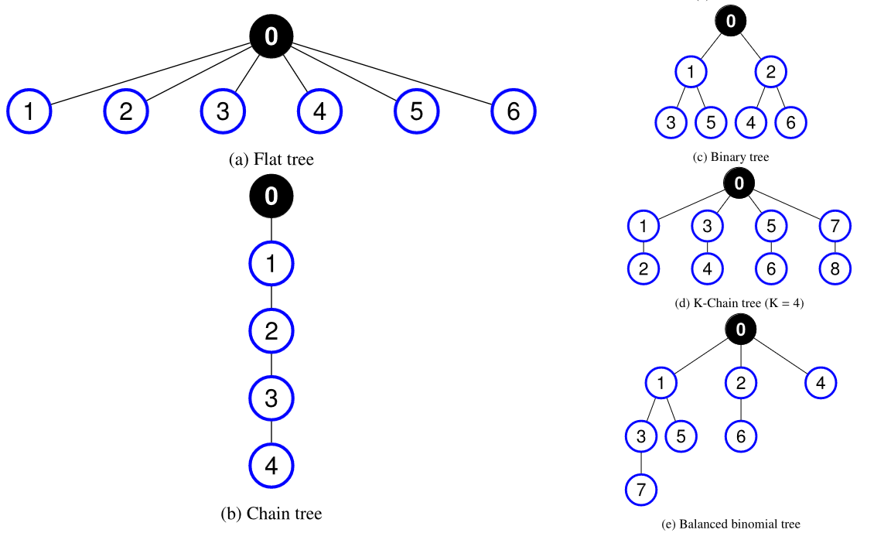
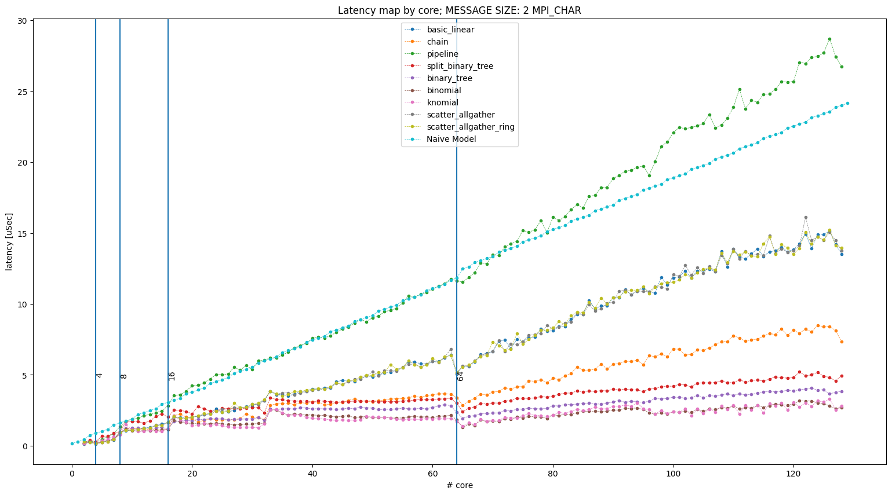

# Exercise 1 for the course High Performance Computing.

This is the exercise for Prof. Cozzini section of the 2023/2024 HPC course. It consists of several possible exercises: please read carefully and decide which one to take. 

This document was cleaned up and completed with additional information  by Niccolo Tosato and Marco Celoria.
Prof. Cozzini aknoledge their kind contribution.


Version `1.0`: this document can be modified several times in the next few days in order to improve the clearness of the information to provide a better understanding of what we are asking.

## Rules

- Exercise should be done individually: no group please !
- Materials (code/scripts/pictures and final report) should be prepared on a github repository, starting with this one and sharing it with the teachers.
- A report should be sent by e-mail to the teachers at least five days in advance: the name of the file should `YOURSURNAME_report.pdf`
- Results and numbers of the exercises should be presented (also with the help of slides) in a max 10 minutes presentation: this will be part of the exam. A few more questions on the topic of the courses will be asked at the end of the presentation.
  

***deadlines***

You should send us the e-mail at least one week before the exam.
For the first two  scheduled "appelli" this means:

 - exam scheduled at xx.02.2024 ***deadline xx.02.2023 at midnight*** 
 - exam scheduled at xx.02.2024  ***deadline xx.02.2023 at midnight***

The report should clearly explain which software stack we should use to compile the codes and run all the programs you used in your exercises. Providing well-done Makefiles/scripts to automatize the work is highly appreciated.

# The exercise: compare different openMPI algorithms for collective operations.

## Introduction

The openMPI library implements several algorithms to perform collective operations according to many different parameters. The exercise consists of an evaluation of some of them for two different collective operations:
  - broadcast operation: mandatory for all
  - a collective operation at your choice among the following four: `gather`, `scatter`, `barrier`, `reduce`.

You are supposed to estimate the latency of default openMPI implementation, varying the number of processes and the size of the messages exchanged and then compare this latter with the values you obtain using different algorithms. 

The exercise does not require any programming effort: students are supposed to use a well-known MPI benchmark: the  [OSU](https://mvapich.cse.ohio-state.edu/benchmarks/) one and they are supposed to run them on at least two nodes of the ORFEO cluster, choosing among *epyc*, *thin* and *fat*, using all the available cores on a single node.

## Steps to be performed

 - Download and compile the OSU benchmark available ON this page: https://mvapich.cse.ohio-state.edu/benchmarks/ .More detailed instruction about compilation can be found [here](https://mvapich.cse.ohio-state.edu/static/media/mvapich/README-OMB.txt) .
 
 - Select 2 whole computational nodes, i.e. two  [epyc|thin|fat] nodes
 
 - Select an additional blocking MPI collective operation you want to test among one of the four listed above. The collective benchmarks binaries files are placed under `osu-micro-benchmarks-7.3/c/mpi/collective/blocking` directory. 
 
 - Familiarize with the `osu_bcast` and the additional collective operation you choose: run several repetitions of the programs and collect performance numbers, estimating the error in order to have a baseline for the two operations. Look at `mpirun osu_bcast --help` to have all options printed out, consider to increment warmup iterations(`-x`) and total iterations (`-i`). 
 
 - Select for the two collective operation (`bcast`, mandatory for all, and the one you selected) at most three possible algorithms and perform the same set of measurements of the previous step.
 
 - Collect and compare numbers among the baseline and the algorithms you choose.
 
 - Try to understand/infer the performance model behind the algorithms you selected, taking into consideration the architecture on which they are being executed.
 
 - Report your result in a nice report and prepare a short presentation (no more than 10 slides)
 
 Feel free to experiment with different messages size and task mapping with `--map-by` option of `mpirun`.
 
## How to select the openMPI algorithms available

Open MPI architecture is based on software components, plugged into the library kernel. A component provides functionality with specific implementation features. For instance, a collective component known as *Tuned* implements different algorithms for each collective operation defined in MPI as a sequence of point-to-point transmissions between the involved processes.
By means of the `ompi_info` we can see the detailed information about the openMPI implementation and parameter that one can choose in order to select different algorithms. In the following we report the parameter you neeed to choose to select different algorithms for the following collective operations:

  - `barrier`
  - `broadcast`
  - `reduce`
  - `gather`
  - `scatter` 

In particular, to retrive all parameters for collective calls use : `ompi_info --param coll all --level 9`.

To enable this choice the following parameter must be specify:
  
        
          MCA coll tuned: parameter "coll_tuned_use_dynamic_rules" (current
                          value: "false", data source: default, level: 6
                          tuner/all, type: bool)
                          Switch used to decide if we use static (compiled/if
                          statements) or dynamic (built at runtime) decision
                          function rules
                          Valid values: 0: f|false|disabled|no|n, 1:
                          t|true|enabled|yes|y

The parameters for the five operation we focus on are the following.
 
- `barrier` algorithms: 

          MCA coll tuned: parameter "coll_tuned_barrier_algorithm" (current
                          value: "ignore", data source: default, level: 5
                          tuner/detail, type: int)
                          Which barrier algorithm is used. Can be locked down
                          to choice of: 0 ignore, 1 linear, 2 double ring, 3:
                          recursive doubling 4: bruck, 5: two proc only, 6:
                          tree. Only relevant if coll_tuned_use_dynamic_rules
                          is true.
                          Valid values: 0:"ignore", 1:"linear",
                          2:"double_ring", 3:"recursive_doubling", 4:"bruck",
                          5:"two_proc", 6:"tree"

- `bcast` algorithms: 
                          
          MCA coll tuned: parameter "coll_tuned_bcast_algorithm" (current
                          value: "ignore", data source: default, level: 5
                          tuner/detail, type: int)
                          Which bcast algorithm is used. Can be locked down
                          to choice of: 0 ignore, 1 basic linear, 2 chain, 3:
                          pipeline, 4: split binary tree, 5: binary tree, 6:
                          binomial tree, 7: knomial tree, 8:
                          scatter_allgather, 9: scatter_allgather_ring. Only
                          relevant if coll_tuned_use_dynamic_rules is true.
                          Valid values: 0:"ignore", 1:"basic_linear",
                          2:"chain", 3:"pipeline", 4:"split_binary_tree",
                          5:"binary_tree", 6:"binomial", 7:"knomial",
                          8:"scatter_allgather", 9:"scatter_allgather_ring"

- `reduce` algorithms:

          
          MCA coll tuned: parameter "coll_tuned_reduce_algorithm" (current
                          value: "ignore", data source: default, level: 5
                          tuner/detail, type: int)
                          Which reduce algorithm is used. Can be locked down
                          to choice of: 0 ignore, 1 linear, 2 chain, 3
                          pipeline, 4 binary, 5 binomial, 6 in-order binary,
                          7 rabenseifner. Only relevant if
                          coll_tuned_use_dynamic_rules is true.
                          Valid values: 0:"ignore", 1:"linear", 2:"chain",
                          3:"pipeline", 4:"binary", 5:"binomial",
                          6:"in-order_binary", 7:"rabenseifner"
                          
- `gather` algorithms:
         
          MCA coll tuned: parameter "coll_tuned_gather_algorithm" (current
                          value: "ignore", data source: default, level: 5
                          tuner/detail, type: int)
                          Which gather algorithm is used. Can be locked down
                          to choice of: 0 ignore, 1 basic linear, 2 binomial,
                          3 linear with synchronization. Only relevant if
                          coll_tuned_use_dynamic_rules is true.
                          Valid values: 0:"ignore", 1:"basic_linear",
                          2:"binomial", 3:"linear_sync"
                          
- `scatter` algorithms: 
          
          MCA coll tuned: parameter "coll_tuned_scatter_algorithm" (current
                          value: "ignore", data source: default, level: 5
                          tuner/detail, type: int)
                          Which scatter algorithm is used. Can be locked down
                          to choice of: 0 ignore, 1 basic linear, 2 binomial,
                          3 non-blocking linear. Only relevant if
                          coll_tuned_use_dynamic_rules is true.
                          Valid values: 0:"ignore", 1:"basic_linear",
                          2:"binomial", 3:"linear_nb"


We provide here an example of how to select different algorithms for a specific operation (i.e. bcast) one should issue the following command:

`$mpirun  --mca coll_tuned_use_dynamic_rules true --mca coll_tuned_bcast_algorithm 0 osu_bcast`

that provides the following output:

```
# OSU MPI Broadcast Latency Test v7.3
# Datatype: MPI_CHAR.
# Size       Avg Latency(us)
1                      13.52
2                      14.06
4                      14.21
8                      14.23
16                     14.65
32                     15.71
64                     15.47
128                    54.24
256                    53.93
512                    51.28
1024                   51.87
2048                   52.75
4096                   57.64
8192                   55.57
16384                  75.01
32768                  83.51
65536                 107.96
131072                132.61
262144                222.99
524288                409.06
1048576               986.45
```

The program gives the latency on 128 processors with the default algorithm chosen automatically by openMPI. One can now play with other algorithms, for instance, number 3 (pipeline):

 ```
$ mpirun  --mca coll_tuned_use_dynamic_rules true --mca coll_tuned_bcast_algorithm 3 osu_bcast


# OSU MPI Broadcast Latency Test v7.3
# Datatype: MPI_CHAR.
# Size       Avg Latency(us)
1                      28.93
2                      26.80
4                      27.49
8                      28.29
16                     30.38
32                     29.78
64                     30.04
128                    34.72
256                    31.95
512                    33.91
1024                   40.92
2048                   47.01
4096                   61.56
8192                   92.10
16384                 295.37
32768                 432.01
65536                 746.98
131072               1375.86
262144               2710.71
524288               5466.00
1048576             11033.92
```

As one can notice the difference is **remarkable**.

## Details on broadcast algorithms

[Reference 1](https://doi.org/10.1016/j.jpdc.2022.03.012) below discuss in detail a few algorithms implemented in the openMPI `MPI_Bcast` routine; we report here a partial section of the paper to help understand better the way they work and to infer a possible performance model for each of them.

In the broadcast operation `MPI_Bcast` a process called root sends a message with the same data to all processes in the communicator. Messages can be segmented into transmissions. Segmentation of messages is a common technique used for increasing the communication parallelism by avoiding the rendezvous protocol, and hence, improving the performance. It consists of dividing up the message into smaller fragments called segments and sending them in sequence.

Every algorithm implementing the broadcast in the *Tuned* component defines a communication graph with a specific topology between the P ranks in the communicator. Ranks are the nodes in the graph, and they are mapped to the processes of the parallel machine. Some features and topology of the broadcast algorithms implemented in openMPI Tuned component are listed below (only 3 listed for brevity, figures from **[1]**):

- *Flat tree algorithm*. The algorithm employs a single level tree topology shown in *Fig. (a)* where the root node has P-1 
 children. The message is transmitted to child nodes without segmentation.

- *Chain tree algorithm*. Each internal node in the topology has one child (see *Fig. (b)*). The message is split into segments and transmission of segments continues in a pipeline until the last node gets the broadcast message. ith process receives the message from the (i-1)-th process, and sends it to (i+1)-th process.

- *Binary tree algorithm*. Unlike the chain tree, each internal pro-
cess has two children, and hence data is transmitted from each
node to both children (*Fig. (c)*). Segmentation technique is employed in this algorithm. For simplicity we assume that the
binary tree is complete, then P = 2H −1 where H is the height of the tree, H = log 2(P + 1).


In [Reference 1](https://doi.org/10.1016/j.jpdc.2022.03.012) all other algorithms are depicted and discussed. 

## Performance model hint

To develop a simple performance model, it is necessary to estimate the latency of point-to-point communication routines, since collectives are built on top of them. You can use the OSU benchmark again, specifically the `osu_latency` tool located in `osu-micro-benchmarks-7.3/c/mpi/pt2pt/standard`. Explore the latency among cores located in different regions of the processor using the `mpirun` option `--cpu-list`. For instance, running `mpirun -np 2 --cpu-list 0,8 osu_latency` will reveal higher latency compared to 2 neighboring cores, as selected by the command `mpirun -np 2 --cpu-list 0,1 osu_latency`.
 
AMD epyc results:

```
$ mpirun -np 2 osu_latency
# OSU MPI Latency Test v7.3
# Size          Latency (us)
# Datatype: MPI_CHAR.
1                       0.15
2                       0.15
4                       0.15
...
...
$ mpirun -np 2 --cpu-list 0,8  osu_latency
# OSU MPI Latency Test v7.3
# Size          Latency (us)
# Datatype: MPI_CHAR.
1                       0.35
2                       0.34
4                       0.35
```

With the help of the latency estimated above we can develop an example of naive model for the broadcast collective while the pipeline algorithm is selected. A naive model with fixed message size is showed below and compared with the true measures collected changing the broadcast communication algorithm and choosing *core* mapping. Many other models, comparison and option are possible. The procedure is similar in case of multiple nodes. 



When building the model of collective keep in mind the mapping specified throught the flag `--map-by`, and the architecture that you are running on.

## References

[1] Emin Nuriyev, Juan-Antonio Rico-Gallego, and Alexey Lastovetsky. *"Model-based selection of optimal MPI broadcast algorithms for multi-core clusters."*.  Journal of Parallel and Distributed Computing, vol. 165, 2022, pp. 1-16. ISSN: 0743-7315. DOI: https://doi.org/10.1016/j.jpdc.2022.03.012. 

[2] You can find other instances of benchmarking, along with information about topology and cluster configuration, in the [official Orfeo documentation](https://orfeo-doc.areasciencepark.it/examples/).

[3] [AMD epyc topology](https://arxiv.org/pdf/2204.03290.pdf)


